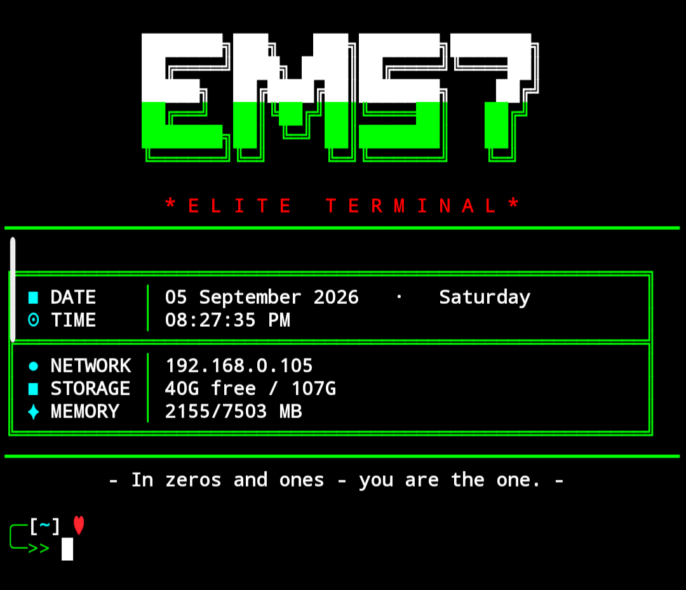

<div align="center">
  <h1>🚀 Termux Elite Setup (Dynamic Edition)</h1>
  <p><i>A beautiful, dynamic, and auto-color-changing setup to transform your boring Termux interface.</i></p>
  
  
  <br><br>
</div>

## 🖼️ Terminal Preview
*(Colors change automatically every time you clear the screen!)*

<div align="center">
  
</div>

<br>

## ✨ Features
- 🎨 **Dynamic Theme Generator:** The banner automatically switches between 4 stunning dual-tone themes (Pink/Blue, Yellow/Green, Cyan/Blue, White/Neon) every time you type `clear`.
- 📊 **Live System Info Update:** Date, Time, Local IP, Storage, and RAM values update in real-time whenever the screen is cleared.
- 🎯 **Flawless Mathematical Alignment:** Pure heavy borders (`━`) and flawlessly calculated column spacing. No broken boxes.
- ⚡ **Zero Config & One-Click Install:** Auto-installs `figlet`, `ncurses-utils`, and custom ANSI Shadow fonts.
- 💻 **Custom Elite Prompt:** Clean, two-line `PS1` prompt with a solid red heart (♥) indicator.

## 🛠️ Easy Installation (Single Command)
Copy the single command below, paste it into your Termux app, and press Enter.

```bash
bash <(curl -fsSL [https://raw.githubusercontent.com/EM57/Termux-Elite-Setup/main/setup.sh](https://raw.githubusercontent.com/EM57/Termux-Elite-Setup/main/setup.sh))
```
(During setup, simply type the name you want to display on the 3D banner!)

💡 How it works
Once installed, your terminal will always open with this gorgeous banner.
Whenever your terminal gets messy, just type:
```bash
clear
```
The screen will instantly wipe clean, generate a brand new color theme, and refresh your clock and RAM usage!
📌 Requirements
Termux App (Ensure it is downloaded from F-Droid, not the Play Store).
Active Internet Connection (Only required during the first setup to download the 3D font and packages).


<div align="center">
<sub>Created with 💙 by <a href="https://github.com/EM57">EM57</a></sub>
</div>
